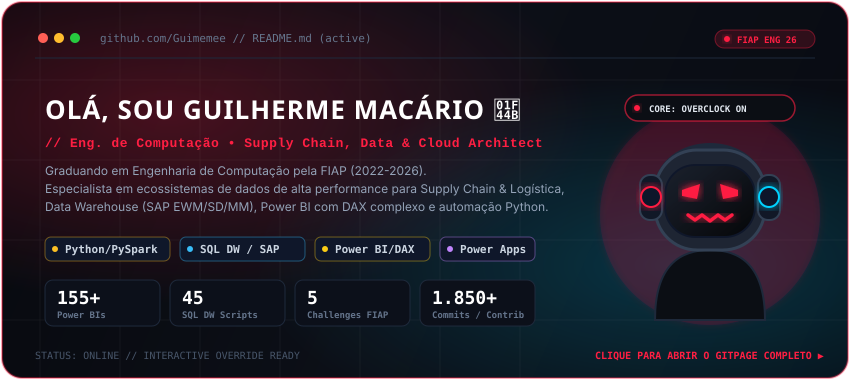

  <!-- Status de Alerta de Segurança no Topo -->
  

    

  <!-- Cartão do Mascote Clicável (Abre o GitHub Pages) -->
  

    

  <!-- Terminal de Aviso que Instiga o Clique -->
  <table>
    <tr>
      <td align="center" style="background:#0b0e14; border:1px solid #ff1e42; padding: 16px;">
        
⚠️ <b>MODO DE VISUALIZAÇÃO ESTÁTICA DETETADO</b>

        
<i>O motor do GitHub bloqueou o rastreamento ocular do mascote, o áudio de estúdio e a decodificação Matrix neste documento.</i>

        
      </td>
    </tr>
  </table>

  👆 <i>Clique na caixa ou no mascote para inicializar os movimentos dos olhos, som e reações em tempo real.</i>

    

  <!-- Seção de Habilidades e Tecnologias -->
  <h3>⚡ Tech Stack & Ferramentas</h3>

  

    
    
    
    
    
    
  

   

  <!-- Painel de Conexões -->
  

    
  

